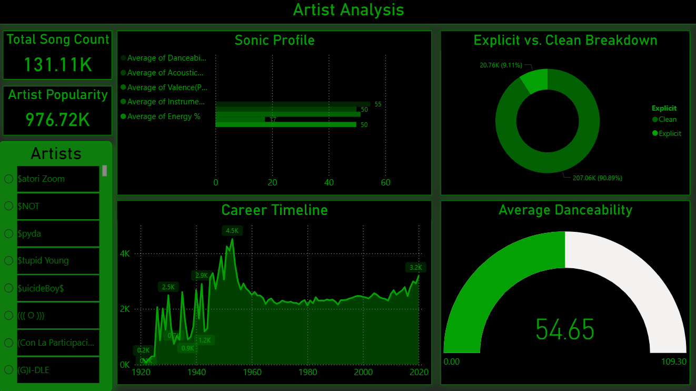
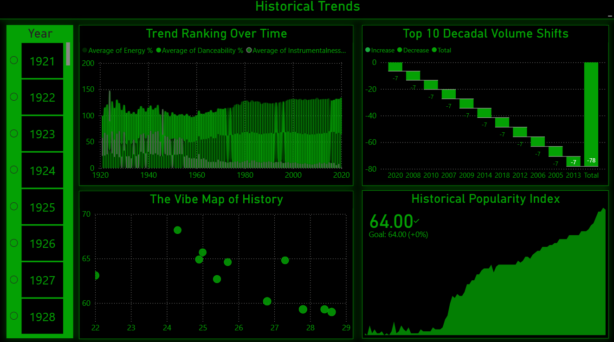
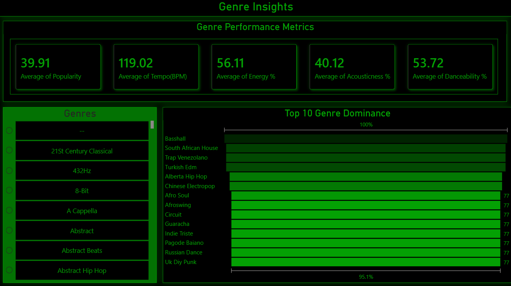
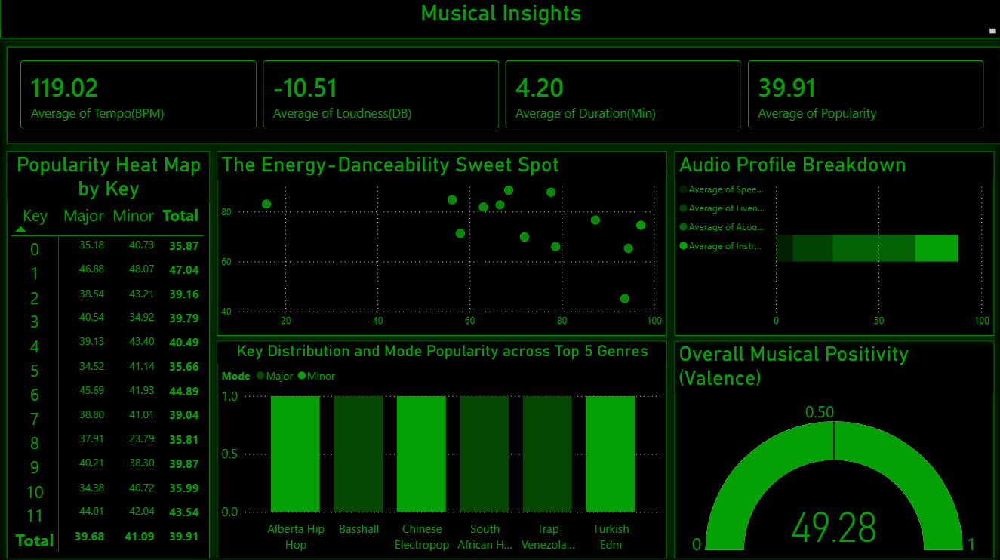

# Spotify Music Trends Analysis (1921-2020)

##  Project Overview
This Power BI project analyzes a century of musical evolution using a dataset of 170k+ tracks. The goal is to decode the "Sonic DNA" of different eras, mapping how audio characteristics like acousticness and energy have shifted from 1921 to 2020. 

The project consists of a high-fidelity, 4-page interactive report suite designed with a professional "Spotify-style" dark mode aesthetic.

##  Key Reports
1. **Artist Analysis:** Deep dive into performer profiles, comparing individual popularity against technical traits (Danceability, Energy, etc.).
2. **Historical Trends:** Visualizing the 'Musical Pulse' across decades, specifically the transition from acoustic-heavy sounds to modern electronic energy.
3. **Genre Insights:** Tracking the distribution and dominance of musical styles through major historical milestones.
4. **Musical Insights:** A technical correlation study between audio features (Loudness, Tempo, Liveness) and overall track popularity.

##  Tech Stack
- **Business Intelligence:** Power BI Desktop
- **Language:** DAX (Custom measures for Dynamic Era Ranges and Popularity metrics)
- **Data Transformation:** Power Query (Data cleaning, normalization, and date formatting)
- **Data Modeling:** Star Schema with bidirectional filtering for seamless interactivity.

##  Data Source
The primary dataset was sourced from Kaggle: [Spotify Data (1921-2020)](https://www.kaggle.com/datasets/ektanegi/spotifydata-19212020).
* **Raw Data:** Includes metadata for over 170,000 tracks.
* **Processing:** Raw data was cleaned in Power Query to handle missing values and organize technical audio features for longitudinal analysis.

##  Report Gallery
| 1. Artist Analysis | 2. Historical Trends |
|---|---|
|  |  |

| 3. Genre Insights | 4. Musical Insights |
|---|---|
|  |  |

##  How to View
1. Clone this repository or download the files.
2. Ensure you have [Power BI Desktop](https://powerbi.microsoft.com/desktop/) installed.
3. Open the `.pbix` file to explore the interactive slicers and dynamic filtering.
